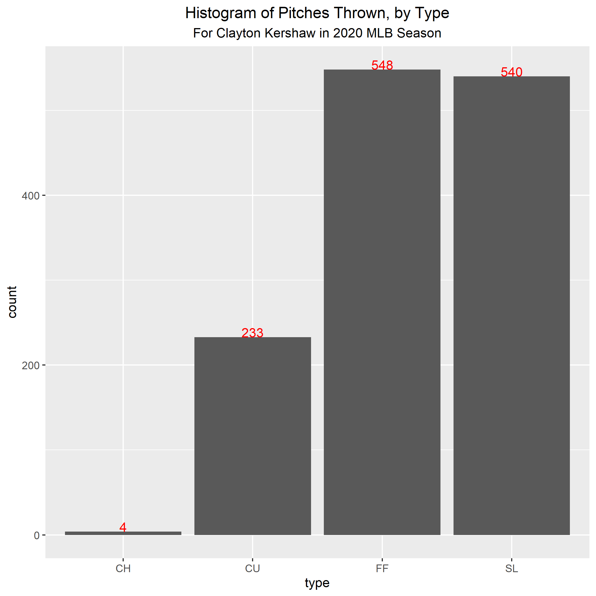
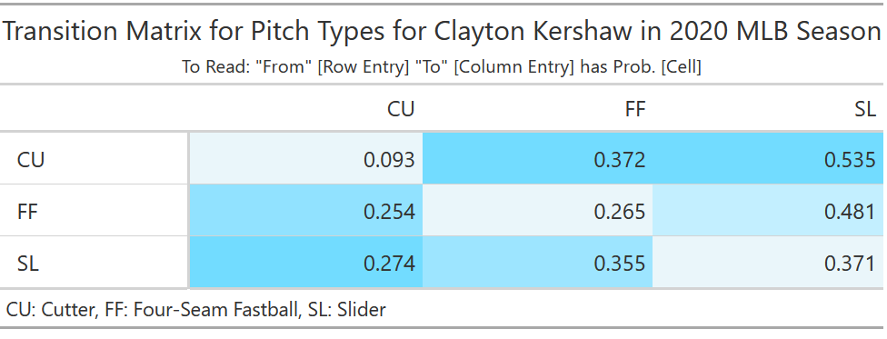
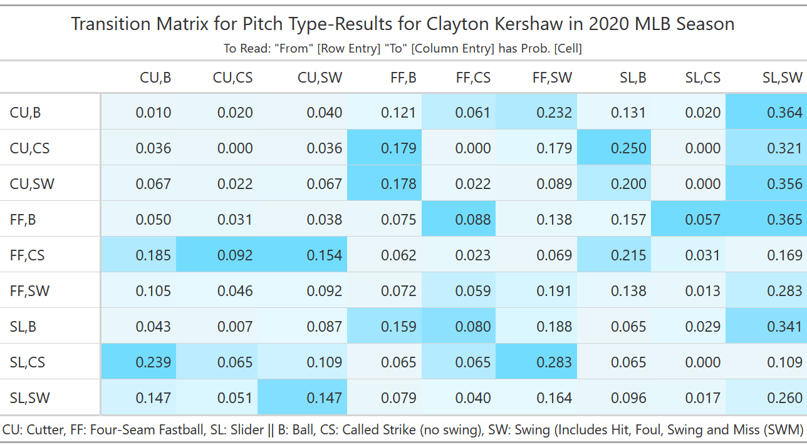
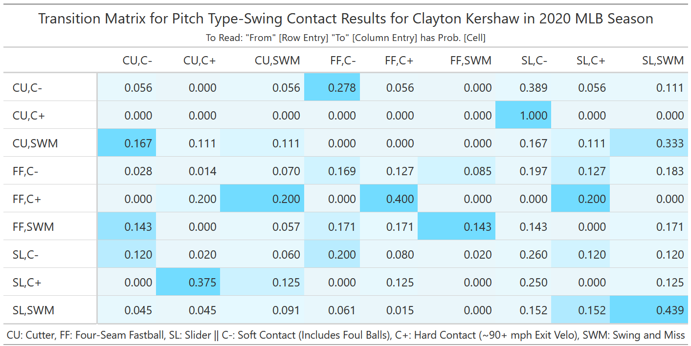
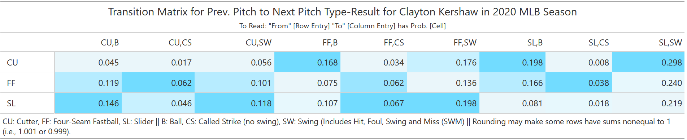
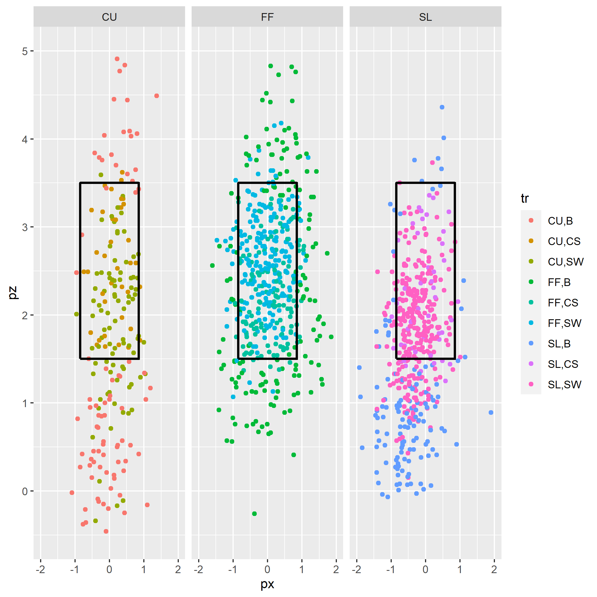
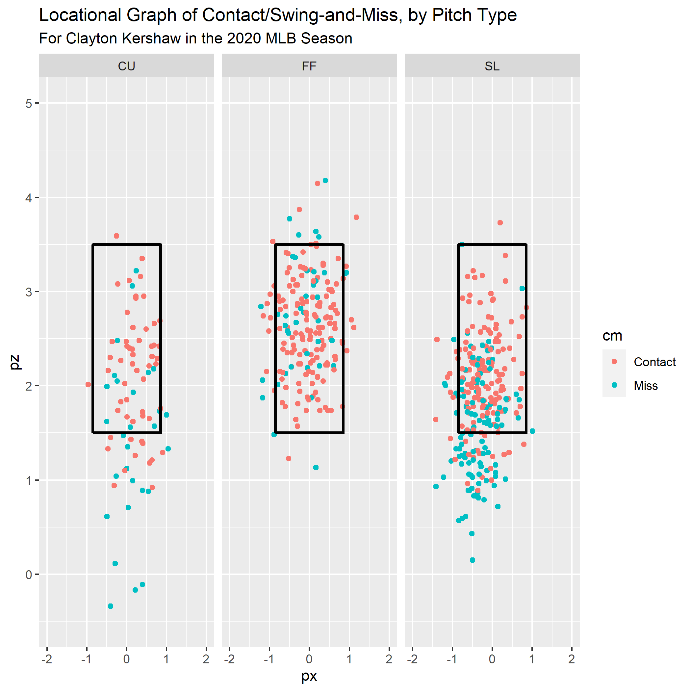
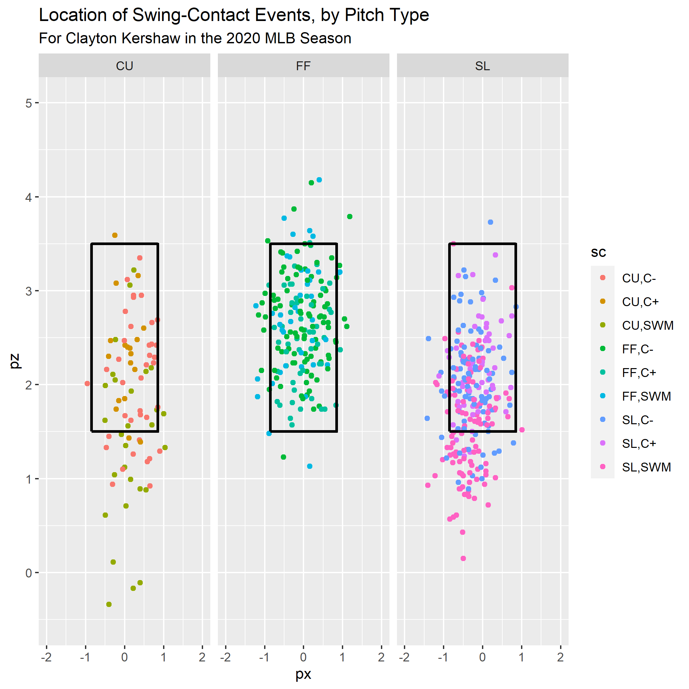
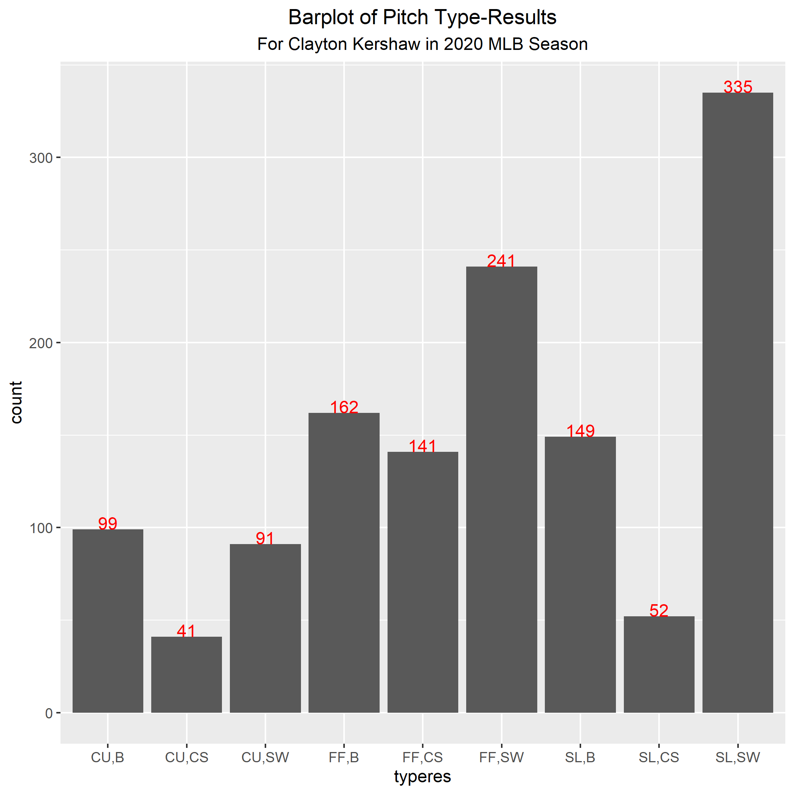
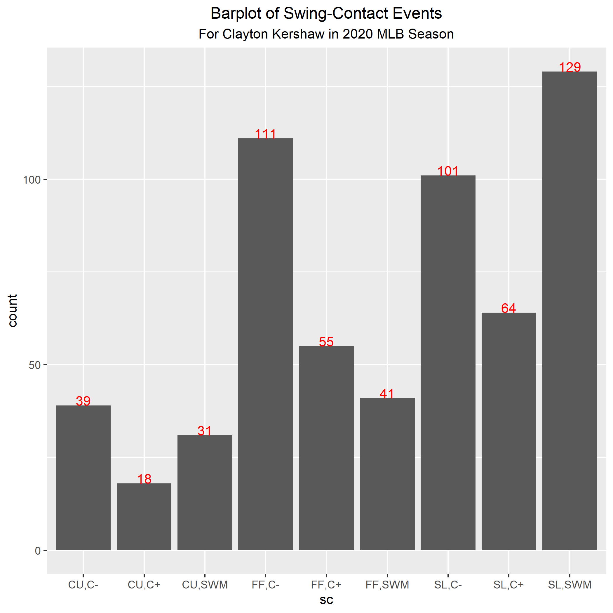

\newpage

### Abstract

Baseball is a game of chess. Coaches and players arrive at situations in which 
their wits are tested, where strategy is paramount, and where little is certain.
A tied game in the 8th, a RISP situation when down multiple runs, or an extra-inning
scenario when attrition and fatigue run rampant all demonstrate how this sport
can benefit from data analysis. 

This report attempts to introduce to the UNC Baseball Analytics Team a method
employed in similar research to a scenario regarding pitcher performance. Principally,
the following document attempts to offer insight into the tendencies of pitcher-catcher relations as it relates to what type of pitch is signaled/thrown, and when. 

### Acknowledgement of Published Literature

I am certainly not the first to employ the to-be-mentioned methods behind Markov
Chains when analyzing pitchers. I have uncovered a few articles and theses that have, 
with much greater academic prowess, outfitted stochastic models to analyze the game 
of baseball. Put simply, I not only want to bring these methods to a collegiate 
scenario, but also desire to further my own knowledge of material I have yet 
to encounter (as tactful course registration has been... difficult, to say the least).

Literature that has greatly inspired this project can be found at the links in the bibliography.

### Desired Goal

To formalize my aspirations for this project:

Given data on a particular pitcher over a given timeframe (i.e., a season, collegiate career, rookie MLB season, etc.), what are the probabilities that they will throw a particular type of pitch within their arsenal, and what willbe the result of said pitch?

Here, there are some vernacular-driven points of ambiguity, so let the following
language be defined here:

$\bullet$ Arsenal: The set of classified pitches utilized.

$\bullet$ Result: One of the following events: strike (non-strikeout), strikeout, ball (non-walk), walk, put-in-play (yielding out), put-in-play (yielding hit).

$\bullet$ Type-Result (tr): The combination of pitch type and Strike/Ball/Swing that helps further breakdown pitches by their resultant at-plate occurrences. 

$\bullet$ Swing-Contact (sc): The combination of a Swing and the resultant contact (hard, soft, not at all).

Let the following terms also be defined here (taken from Casey, 2016):

$\bullet$ Transient State: A state allowing for a possible shift to another. Or, a node that is not a sink node (in a Graph Theory context).

$\bullet$ Absorbing State: A state allowing for no more possible shifts within a sequence of events. Or, a sink node (in a Graph Theory context).

### Background: Markov Chains?

At this point (if the reader hasn't skipped a word), it might be obvious that a 
Markov Chain needs to be defined. Given that I have not formally learned this in
a collegiate course, I will be utilizing and crediting the aforementioned Harvard
thesis and article (https://brilliant.org/wiki/markov-chains/) in my description of
this mathematical model. 

Markov Chains can be thought of as mathematical graphs, with each node $n_p$ 
representing a particular pitch type $p$ in an arsenal $P$. A directed edge connecting
two nodes is the probability that, having arrived at node $n_{p1}$, what is the 
probability that the state of an at-bat will arrive at $n_{p2}$. An inquisitive mind 
might then ask: what about the probability of arriving at $n_{p1}$; does that not 
play a factor? 

The answer is rather multifaceted: while yes, the different paths possible to arrive
at a node multiple states away constitute a single probability of arriving at said node
at some point, multiple paths are rendered unreachable once the first step has been 
taken. Think of a Markov Chain as a giant, intertwined and interconnected, Monty Hall 
Problem. 

For those unfamiliar, consider this scenario:

$\bullet$ There are three doors, behind one of which is a car.

$\bullet$ A game show host asks you to pick a door. (Your chance of correctness: 33%).

$\bullet$ The host opens a different door, revealing nothing behind it. 

$\bullet$ The host asks, "Do you want to switch?" The question: Should you?

The answer is yes; after the door having nothing has been revealed to you, the 
chance of the unnoticed door having the car is now 50%, compared to 33% a short time
ago. Switching gives you a 1.5x greater chance of landing the car than before (50 / 33 
~ 1.5).

Applying this tangent: shifting into one particular state renders other previously 
attainable states unattainable. However, I never actually directly answered the posed 
question. The interesting secret: while a pitch two states ago in an at-bat might have
bearing on a batter's OBP in the context of that sequence of pitches, the effect is 
(assumed to be) minimal. 
Casey credited a source in their publication that found a ~0.2% point 
fluctuation in OBP when considering/not considering a pitch two states prior, so 
they, as I will, chose to focus on just the previous pitch in an at-bat. 

The Monty Hall Problem actually demonstrates another property of Markov Chains (as 
should hopefully be the case with any and all probabilistic models): the probabilities 
of shifting to all possible states add up to 1. At first, the state is 0.33 + ... + 
0.33 = 1, but it shifts to 0.5 + 0.5 = 1 after the host's gimmick. 

Markov Chains tend to be more aptly represented in Transition Matrices, where nodes
line the rows and columns and the (i,j)-th entry of a matrix represents the weight of 
the directed edge from node $n_{i,1}$ to $n_{i,j}$. Malter's article showcases this 
when analyzing starter Chris Sale and his pitch tendencies. 

Note that in a transition matrix, the sum of all entries in a row or column are 1.
Therefore:

\[ \sum_{j=1}^{n} c_{i,j} = 1 \], for \[1 \leq i \leq m \], given an \[ m \times n\] 
transition matrix.

Because there are multiple types of states, such
Markov-chain-driven transition matrices constitute "Multi-Stage" Markovian models.

### Setup

This report will include the source code for this Markov Chain analysis, along with
commentary regarding its calculations, surprising discoveries, and potential points of
ambiguity or possible need for further data cleaning and feature engineering when 
encountering unknown anomalies. 

The language of choice will be the R programming language.

**Version Specifics**:

- OS: Windows 10
- R Version: 4.0.3
- Scripting hosted by RStudio.

**Packages Used**: 

$\bullet$ readr (general purposes, reading data)

$\bullet$ devtools (in conjunction with baseballr)

$\bullet$ baseballr (webscraping from baseballsavant.com)

$\bullet$ dplyr (effective data manipulation)

$\bullet$ ggplot2 (visual plotting package)

$\bullet$ msm (Markov chain and transition matrix package)

$\bullet$ leaflet (color tabular objects)

$\bullet$ gt (table package)

$\bullet$ webshot (knit R notebook to PDF)

$\bullet$ ricomisc (view html objects directly from code)

$\bullet$ pitchRx (strikezone plot)

\newpage

### Functions

*Quick Aside*: All of the formal code for these functions will be present in 
the corresponding Github Repository, linked at the beginning of these report. The code has been removed here for the sole purpose of brevity (or, to at least combat excessive length...).

**Function Details**:

$\bullet$ **color_table** (credit: see Stack Overflow citation)

*Parameters*:

- 'gtobj': Tabular object created using 'gt' package.
- 'dataframe': Dataframe representation of the transition matrix returned in
               'markovTransitionMatrix'
               
*Returns*:

- 'gtobj': Colored gtobj for saving, viewing, etc.

$\bullet$ **fill_column** (credit: see Stack Overflow citation)

*Parameters*:

- 'gtobj': Tabular object created using 'gt' package.
- 'dataframe': Dataframe representation of the transition matrix returned in
               'markovTransitionMatrix'
- 'column': A particular column of the dataframe to which values are input.

*Returns*:

- 'gtobj': Partially-filled table. Function is repeated over all columns.

$\bullet$ **idCreator**

*Parameters*:

- 'dataset': Statcast-scraped dataset.

*Returns*:

- 'dataset': Statcast-scraped dataset, now with identifications.

$\bullet$ **markovTransitionMatrix**

*Parameters*:
- 'dataset': Statcast-scraped dataset.

- 'statesVar': Column of 'dataset', of the format 'dataset$variable', that contains rows, 
             columns of the eventual matrix (a.k.a. the nodes in the Markov chain).
             
- 'dividerVar': Column of 'dataset', of the format 'dataset$variable', that contains a unique
              and appropriate identification (e.g., the ID of the at-bat from 'idCreator').
              
- 'precision': The number of digits to which to round the entries of the matrix.

- 'titleString', 'subtitleString', 'captionString': Strings that respectively constitute the title, subtitle, and caption.

- 'filenameToSave': String, ending in .html, to save the matrix to (saves in curr. working 
                  directory).
                  
*Returns*:
- 'table': Field that contains the 'gt' object for viewing inside of R.

- 'file': File in current working directory that references the created 'table.'

- 'matrix': The 'matrix' object that can be accessed and manipulated without changing the 
            appearance of 'file' or 'table.'

$\bullet$ **probThreeEvents**

*Parameters*:

- 'values': For the purpose of this function, a $3$ by $n$ matrix. Can 
            ultimately be formatted, using the correct Inclusion-Exclusion formula, 
            for an $m$ by $n$ matrix.

*Returns*:

- 'probs': $n$ probabilistic values for a simplified version of a transition matrix. 
           See the resulting section on this for a more purposeful explanation.

$\bullet$ **saveMatrix**

*Parameters*: 
- 'matrix': The 'gt' object containing a filled and colored transition matrix.

- filename: String, ending in .html, to save the matrix to (saves in curr. working 
                  directory).

$\bullet$ **selectPitcher**

*Parameters*:
- 'dataset': Statcast-scraped dataset.

- 'name': String of "[firstName] [lastName]" to filter 'dataset' by. 
          *Note*: This function can be changed out for baseballr::player_lookup, 
           if necessary.
           
*Returns*:
- Filtered dataset (no explicit variable name in the function, as it's one line).

$\bullet$ **swingMatrixStates**

*Parameters*:

- 'dataset': Statcast-scraped dataset.
- 'hcThreshold': Float value that user determines to be a demarcation of 'Hard Contact.'
- 'hcEpsilon': Float value by which the user wishes to extend the 'hcThreshold'.

*Returns*:

- 'dataset': Dataset with appropriate swing-contact states.

$\bullet$ **typeResMatrixStates**

*Parameters*:

- 'dataset': Statcast-scraped dataset.

*Returns*:

- 'dataset': Dataset with appropriate type-result states.

\newpage

### Pitcher Analysis: Clayton Kershaw

In honor of the recent World Series champions, the Los Angeles Dodgers, analysis will be 
conducted of one of their most prominent pitchers throughout his MLB career -- Clayton 
Kershaw.

Making variables by which to identify particular games and at-bats may serve well
in analysis of interesting conclusions, so let 'abID', 'gameID', and 'orderID' columns
be added.

Obviously, we want the representation of pitches in our matrix to be *somewhat* 
normally distributed. 

And, while this data varies for each pitcher, the following chunk shows
Kershaw threw 4 Changeups in the regular season.  
Therefore, the probabilities of him throwing a Changeup for a Strike/Ball/etc. 
are so infinitesimally small in the context of the entire season 
that I will remove them from consideration to make the matrix more readable.

\newpage

#### Transition Matrix: Pitch Types

For Kershaw specifically, let the following figure signify the transition matrix for 
*just* the types of pitches thrown. No consideration of their results is depicted here, as 
that will be done in a later chunk.

Each state in the matrix can arguably be considered both transient and absorbing -- within a 
reference frame of the previous pitch, the pitches along the columns are those that indicate a
shift to their respective states. The reference frame then shifts to where the previously 
shifted-to pitch becomes from what will be shifted to another state.

\newpage

#### Transition Matrix: All Pitch Type-Results

In order to create any transition matrix, the labels for transient and absorbing states 
are required. These will be explicitly defined when I introduce the tables into this report, 
for each respectively, but let the following figure signify the creation of a unique ID for 
each transition within the Markov chain states for considering *type of pitch* and *result*.

\newpage

#### Transition Matrix: Level of Swing Contacts

Now, let only the pitches in which swings occur be examined. 

Let the following transition matrix represent the Markov Chain model in which differing 
levels of contact are analyzed.

\newpage

### Commentary on Results

As many avid baseball fans know, Kershaw is a pitcher known for filthy offspeed pitches and his general ability to limit opposing offenses. However, an interesting discovery using the Markov Chain Analysis was the potential behind his slider to generate much of the same effects.

In essence, the two could be considered a 1-2 punch: the slider retains much of the high velocity that similar pitches have (e.g., fastballs), but their movement adds a deceptiveness that hitters may recognize as a fastball. This is strongly supported by the proportions of swings Kershaw generates on his pitches -- the slider receives more swings after the majority of pitches (with the exception of a Slider called a strike) than does his Fastball or Curveball. Of these swings, the majority of sliders garner soft contact, fouls, or misses, thus assumedly yielding more strikeouts, defensive outs, etc.

However, consider the following question:

$\bullet$ What about analyzing the results of a pitch, irrespective of the call or plate event garnered by the previous pitch? 

In essence, this can (hopefully) simplify the second transition matrix into the scenario, "Okay, the batter just saw a Fastball. What are the chances he swings at the next pitch, if it is a Slider?"

Thus, let the following R chunk attempt to combine the probabilities of the rows of the second matrix while preserving the columns (for these calculations, I am stating that a curveball called a Ball and another called a Strike are independent events -- a pitch is not both a ball and strike):

To be perfectly honest, I am unsure if these calculations are correct. While the rows 
have been forcibly made Markovian (by dividing by each row's sum to "normalize" them), both the treatment of the events as independent and the possible misuse of some calculation completed under-the-hood of *statetable.msm()*, the function that generates the counts for these matrices before a separate calculation makes them probabilistic, are potential points that may skew or exaggerate some of the tendencies.

However, I am a little optimistic that the above table has merit; this simplified version of the *m2$table* object retains a lot of the same generalizations -- sliders continue to get a large proportion of swings, regardless of the previous pitch. Though I am not going to remove the second matrix that breaks-down these rows into each previous pitch type-result scenario, I do believe that readers may find the above matrix more tangible and beneficial in both self-comprehension and communication with hitters and pitchers about their at-plate performances.

*Quick Aside:* 
The *colors* on the tables are respective to that particular *column*. The code and package I found with which to do this was rather unfamiliar to me, so I did some research into the methods and produced what I hope is a legible table! 

\newpage

### Generalized Statements

From Markovian analysis, I found the following within Kershaw's performance during the regular season:

$\bullet$ Kershaw seldom threw a Curveball for a Strike after another pitch, having much more success with his Fastball and Slider in this capacity.

$\bullet$ However, when he frequently threw a Curveball, the following pitch worked enormously in his favor -- he gained a strike in the count or had the batter swing (and potentially miss, judging the third matrix), and had repeated success utilizing a Curveball-Slider combination for deceptive pitching.

The level of success Kershaw acheived with his slider was rather surprising, in all honesty; even after a batter missed a slider, the probability they did so again was ~45%, in the context of all possible type-results!

### Visualizing Pitches with Strikezone Plots

Defining the location of the strikezone (credit goes to Jordan Levin for the code
that defines this geom_path() at https://rstudio-pubs-static.s3.amazonaws.com/462182_b61971e803a845dc82c907f804da09d8.html):

\newpage

Analyzing *just* the swings:

\newpage

### Reflection on Methods, Potential Issues

As with anything probabilistic, sample size becomes a point-of-question:

\newpage

*...but obviously so, right?* One should hope that the number of strikes is greater than balls, outs greater than hits, missed swings greater than hard-hits that might yield XBHs, and walks nearly nonexistent. Though because each possible shift in state is arguably independent of others in a particular Markov chain, given a node $n$, the tabular form of this analysis still functions as an effective representation of the possible sequences of events a pitcher can incur. 

Returning to the point included by Casey in their thesis regarding including pitches two-states prior being unnecessary, one can not help but think this may have some influence on the probability values obtained through Markov Chains. Because the effect was assumed to be minimal (the original paper publishing that theory was from 2006, but Casey still utilized the idea a decade later), I believe that any additional variability that might be explained is so infinitesimally small that Multi-State Markov Chains and Transition Matrices (of order one, as these are; order-two Markov Models that would be fitting for these types of situations do exist, but Casey noted only minuscule potential improvements) still retain their viability in analyzing the game of baseball from a one-pitch frame-of-reference.

### Potential Applications 

Markov Chains, in my preliminary research and thought, might have additional applications in baseball such as:

$\bullet$ Hitting: The complement to pitching, hitting is another pillar of baseball. As such, Markov Chains may be able to analyze a hitter; given a pitch and its call, what is the likelihood they get a hit on the next pitch? 

$\bullet$ Scoring: Analyzing the states of the base-paths using Markov Chains might be able to answer questions of a team's expected Runs for a particular timeframe, whether it be the next game, season, etc. This could also have applications in calculating WAR (Wins Above Replacement), if it does not already.

$\bullet$ Analyzing Other Pitchers: Obviously, the applications of this type of stochastic model are far more than just Kershaw's pitches! I personally want to make this script into an executable, but I fear that it may overlook necessary data cleaning (e.g., the one at-bat the entire season in which Kershaw threw a changeup... or at least what Statcast thought was a changeup).

### Conclusion

At UNC, Markov Chains are discussed in STOR 445, I believe, and potentially other courses
such as Discrete Mathematics and Probability. I have yet to have the opportunity to encounter them in an academic capacity (thanks registration times...), and, seeing their viability in the collegiate level of analyzing pitchers when combined with batter scouting reports, I found this to be both an opportunity of learning and presentation. 

I greatly appreciate the reading of this proposal, and for Jake Oringel and Jeremy Vlacancich hosting this bootcamp from a remote setting! The flexibility and guidance they offered me as I pursued a project topic and sought to quantify my proposal with meaningful data and representations has greatly benefitted me.

If there are any issues or mistakes in this document, please do not hesitate to contact me at the email listed on the first page.

\newpage

\begin{center}

\large
\textbf{Bibliography}

\end{center}

Casey, Nathaniel. "A Markov Approach to Modeling Baseball At-Bats and Evaluating Pitcher Decision-Making and Performance." Digital Access to Scholarship at Harvard, Harvard University, 2016, https://dash.harvard.edu/handle/1/38811463.

Malter, Danny. "Using Markov Chains to Predict Pitches." Exploring Baseball Data with R, 31 Mar. 2016, 
https://baseballwithr.wordpress.com/2016/03/31/using-markov-chains-to-predict-pitches/.

Multiple Authors. "How to conditionally format a cell in a [gt] table based on the value of the cell." Stack Overflow, 17 Sep, 2020, https://stackoverflow.com/questions/63944953/how-to-conditionally-format-a-cell-in-a-gt-table-based-on-the-value-of-the-cel 

